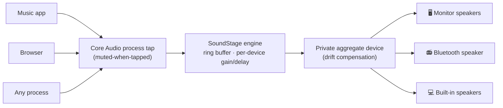
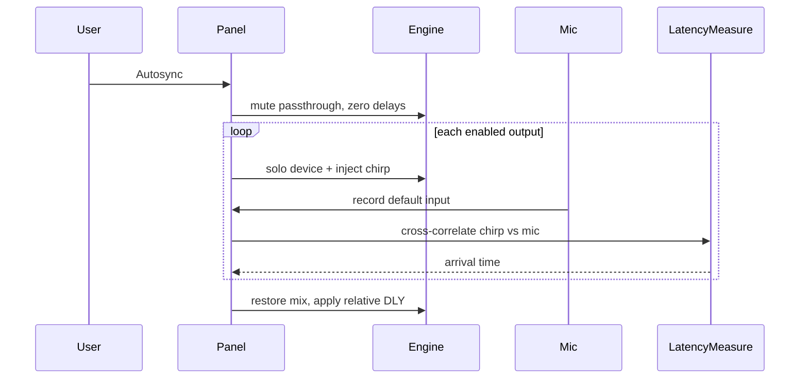

<div align="center">

# SoundStage

**Play system audio through all your output devices at once — with per-device volume, latency alignment, and live metering. From your menu bar.**

[](https://github.com/nintang/soundstage/actions/workflows/release.yml)


</div>

---

macOS lets you pick *one* output device. SoundStage removes that limit: your monitor's speakers, a Bluetooth speaker, and the built-in speakers can all play together — each with its own volume, its own delay to fix Bluetooth lag, and a live level meter. It's the "Multi-Output Device" from Audio MIDI Setup, if it had a volume mixer, latency alignment, and lived in your menu bar.

## Features

- 🔊 **All devices at once** — HDMI/DisplayPort monitors, Bluetooth speakers, built-in speakers, USB interfaces, AirPlay
- 🎚 **Per-device volume** (0–150%) plus master volume — something macOS multi-output can't do at all
- ⏱ **Per-device delay** (0–750 ms) — Bluetooth speakers lag behind wired ones; delay the wired outputs until the echo collapses into a single sound
- 🎯 **Autosync** — one-shot mic measurement that fills in those delays for you ([guide](docs/AUTOSYNC.md))
- 📊 **Live level meters** for every device
- 🔌 **Auto-rejoin** — a Bluetooth speaker that reconnects automatically rejoins the mix
- ▶️ **Auto-resume** — quit while routing, and the next launch (or reboot, as a Login Item) picks up exactly where you left off
- 🫥 **Menu bar native** — SwiftUI `MenuBarExtra`, no Dock icon, ~2 MB, zero dependencies
- ⌨️ **Global hotkey** — **⌃⌥/** shows or hides the mixer while running ([guide](docs/HOTKEY.md))

## Install

**Download:** grab `SoundStage.app.zip` from [Releases](../../releases), unzip, drop into `/Applications`.

The app is not notarized (no paid developer account), so on first open macOS may refuse with a vague error. Privacy toggles do **not** clear that. Fix with:

```bash
xattr -dr com.apple.quarantine /Applications/SoundStage.app
```

…or right-click the app → **Open** → **Open**.

SoundStage has **no Dock icon**. On launch it opens a small mixer window; look near the clock for **SoundStage** as well. While it’s running, **⌃⌥/** (Control–Option–Slash) shows or hides that mixer from any app — see [docs/HOTKEY.md](docs/HOTKEY.md) (including cold start via Shortcuts). On macOS 26, if the menu-bar item is missing, turn it on under **System Settings → Menu Bar** (or use **Menu Bar Settings…** in the mixer).

Then **▶ Start** and allow **System Audio Recording**. If you allowed permission while the app was already running, Quit and reopen once. After a rebuild, if Start is silent but Privacy still looks ON, toggle SoundStage off/on in **Screen & System Audio Recording** (both lists on macOS 26).

**Or build from source** (takes ~1 min, needs Xcode command line tools):

```bash
git clone https://github.com/nintang/soundstage.git
cd soundstage && ./macos/make-app.sh && ./macos/install.sh
```

## First run

1. Use the mixer window (or the  sliders item in the menu bar)
2. Toggle on the devices you want, hit **▶ Start**
3. macOS asks for **System Audio Recording** permission — allow it (that's how SoundStage taps the audio stream; nothing is recorded or stored)

### Getting devices in sync

Bluetooth adds 100–300 ms of latency, so a Bluetooth speaker will echo behind wired outputs. You can't make Bluetooth faster — so make the others later: delay the *fast* (wired) devices until they line up with the *slow* one.

<div align="center">

<p><sub>After Autosync: Bluetooth stays at 0 ms; the faster Built-in output is delayed (~200 ms here) so both hit your ears together.</sub></p>
</div>

**→ Full guide:** [docs/AUTOSYNC.md](docs/AUTOSYNC.md) — when to use it, what you’ll hear, permissions, tips, FAQ, and troubleshooting.

**In short:** with routing live and ≥ 2 devices enabled, sit where you listen → **Autosync** → allow the mic → short chirps per speaker → **DLY** fills in (nearest ms). Re-run if echo returns. Or drag **DLY** on wired devices by ear (often 150–200 ms to start). Prefer a **wired Clock** for day-to-day stability.

### Start on boot

Add SoundStage to **System Settings → General → Login Items**. Combined with auto-resume, a reboot brings your whole mix back with zero clicks — and **⌃⌥/** can show/hide the mixer anytime the app is running ([hotkey guide](docs/HOTKEY.md)).

## How it works



SoundStage creates a **global Core Audio process tap** (`CATapDescription`, macOS 14.4+) that captures every process's audio and simultaneously mutes it at the hardware — so sound only reaches the devices *you* choose, with no doubling. The tap feeds a **private aggregate device** containing your selected outputs; Core Audio drift-corrects each device against the clock device, and the engine's realtime callback applies per-device gain, delay (a shared ring buffer read at per-device offsets), and RMS metering. No kernel extensions, no virtual audio drivers, no installers.

### Autosync

One-shot mic calibration that fills **DLY** automatically. Full user guide (how to use it, what happens, troubleshooting): **[docs/AUTOSYNC.md](docs/AUTOSYNC.md)**.



See [docs/ARCHITECTURE.md](docs/ARCHITECTURE.md) for the deep dive (including Autosync measure mode).

## Limitations

- Audio is captured as a **stereo mixdown** — multichannel sources are folded to stereo before distribution
- Bluetooth latency **varies over time**; a delay that's perfect now may drift by tens of ms during a session (re-run **Autosync** or nudge **DLY** — see [docs/AUTOSYNC.md](docs/AUTOSYNC.md))
- Requires **macOS 14.4+** (the process-tap API is recent); Apple Silicon
- While routing is active, the volume keys control SoundStage's devices only via the panel (the system volume HUD is bypassed)

## License

[MIT](LICENSE) © David Nintang
