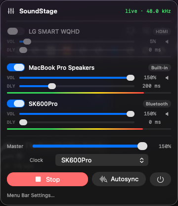

# Autosync

  

SoundStage can play the same audio through several outputs at once. Those devices almost never start at the same instant — Bluetooth especially lags wired speakers by hundreds of milliseconds — so you hear an echo or “stadium” effect.

**Autosync** measures that lag once and fills in the **DLY** (delay) sliders for you. It plays a brief chirp from each output, records it via your microphone, and calculates the exact arrival times to determine the delay to the nearest millisecond.

<div align="center">

<p><sub>Typical result: the slow Bluetooth speaker stays at <strong>0 ms</strong>; faster outputs (here, Built-in) get delayed so everything arrives together.</sub></p>
</div>

---

## What Autosync is (and isn’t)

| Autosync **is**                                               | Autosync **is not**                                      |
| ------------------------------------------------------------- | -------------------------------------------------------- |
| A **one-shot** button you press when you want alignment       | Continuous microphone listening in the background        |
| A way to set **per-device delay** automatically               | A volume or EQ fix                                       |
| Using the mic **only during that run** (nothing saved to disk)| Recording your music or conversations                    |
| Something you can **re-run** anytime echo comes back          | A permanent lock — Bluetooth lag still drifts over time  |

You can always edit **DLY** by hand after Autosync. The button just gets you close (usually to the nearest millisecond) without dragging sliders by ear.

---

## When to use it

Use Autosync when:

- You enable **two or more** outputs (e.g. Mac speakers + Bluetooth)
- You hear a **distinct echo** or flanging between devices
- You moved speakers, changed Bluetooth gear, or the mix “drifted” after a while
- You’re setting up SoundStage for the first time with a multi-speaker mix

Skip it (or use manual DLY) when:

- Only **one** device is enabled — there’s nothing to align
- The room is very loud / the speakers are barely audible at the Mac
- You only need a rough sync and already know “~180 ms on wired”

---

## Quick start

1. **Start** SoundStage routing (green → live) with the devices you care about **enabled**.
2. Sit (or place the Mac) **where you normally listen**. The built-in mic is the measurement point.
3. Turn volume up enough that each speaker is clearly audible from that spot (Master / per-device VOL).
4. Click **Autosync**.
5. Allow **Microphone** access if macOS asks.
6. Wait while the status shows `Syncing DeviceName…` — you’ll hear a short **chirp** from each speaker in turn.
7. When it finishes, check the **DLY** values. Play music; the echo should be gone or nearly gone.
8. Optional: nudge **DLY** a few ms by ear, or press Autosync again.

**Tip:** Leave **Clock** on a **wired** device (Built-in is ideal) for day-to-day stability. Autosync still measures correctly if Clock is on Bluetooth, but wired clocks drift less.

---

## What you’ll hear and see

During a run:

1. Your normal music/system audio is **briefly muted** from the mix (measure mode).
2. One speaker at a time plays a short rising **chirp** (~0.12 s).
3. The panel shows which device is being measured.
4. Start / Autosync / Quit stay disabled until the pass finishes or fails.
5. On success, **DLY** sliders jump to new whole-millisecond values and are saved with your other settings.

On failure, nothing partial is kept — previous delays are restored and a short error appears (see [Troubleshooting](#troubleshooting)).

---

## What’s actually happening

You can’t make a slow device play *earlier*. SoundStage delays the **faster** ones until they match the **slowest**.

<div align="center">
  <table>
    <thead>
      <tr>
        <th align="left">State</th>
        <th align="left">Output</th>
        <th align="left">Timeline</th>
        <th align="left">Result</th>
      </tr>
    </thead>
    <tbody>
      <tr>
        <td rowspan="2"><b>Before Autosync</b><br><i>(typical setup)</i></td>
        <td> Built-in</td>
        <td>🟩🟩🟩⬜⬜⬜⬜⬜⬜</td>
        <td>Arrives first</td>
      </tr>
      <tr>
        <td> Bluetooth</td>
        <td>⬜⬜⬜⬜⬜⬜🟩🟩🟩</td>
        <td>Arrives ~200 ms later<br> <b>You hear an echo</b></td>
      </tr>
      <tr>
        <td rowspan="2"><b>After Autosync</b></td>
        <td> Built-in</td>
        <td>⬜⬜⬜⬜⬜⬜🟩🟩🟩</td>
        <td>Delayed ~200 ms</td>
      </tr>
      <tr>
        <td> Bluetooth</td>
        <td>⬜⬜⬜⬜⬜⬜🟩🟩🟩</td>
        <td>Still "late," but aligned<br> <b>One sound</b></td>
      </tr>
    </tbody>
  </table>
</div>

Under the hood, for each enabled output:

1. **Solo** that device (others silent).
2. Inject a known **chirp** through SoundStage’s normal audio path (same route your music uses — not a separate system beep).
3. Record from the **default microphone**.
4. **Cross-correlate** the recording with the chirp to find when the sound arrived.
5. Prefer the **earliest strong peak** (direct path to the mic), not a louder wall reflection later.
6. Fit the peak with sub-sample precision, then round the final delays to the **nearest millisecond**.

After all devices are measured:

```math
\text{delay}[\text{device}] = \max(\text{arrivalTimes}) - \text{arrival}[\text{device}]
```

So the slowest path gets **0 ms**; everyone else is delayed to meet it (clamped to 0–750 ms).

For engine-level detail (measure mode, ring buffer, retries), see [ARCHITECTURE.md](ARCHITECTURE.md#3b-autosync-one-shot-mic-calibration).

---

## Permissions

Autosync needs **two** separate macOS permissions:

| Permission                                                         | Why                                        |
| ------------------------------------------------------------------ | ------------------------------------------ |
| **System Audio Recording** (Screen & System Audio Recording) | SoundStage’s normal routing / process tap |
| **Microphone**                                               | One-shot capture during Autosync only      |

If Microphone was denied: System Settings → Privacy & Security → **Microphone** → enable SoundStage, then run Autosync again.

SoundStage does **not** write mic audio to disk. The buffer lives in memory for the measurement and is discarded when the run ends.

---

## Tips for a clean measurement

- **Listen from the sweet spot.** If the Mac sits on a desk next to the Built-in speakers, Autosync will “hear” those as much closer/louder than a Bluetooth speaker across the room. That’s correct for the mic — move the Mac to the couch if that’s where *you* sit.
- **Quiet enough room.** TV, fans, and talking can bury the chirp. Pause noisy apps if a run fails.
- **Audible chirps.** If a device is muted or VOL is near zero, measurement will fail for that speaker.
- **HDMI / DisplayPort.** Displays that already struggle in multi-output aggregates may fail measure; try Built-in + Bluetooth first.
- **Re-run after changes.** New speaker, new BT codec path, waking from sleep, or a long session — lag can shift by tens of ms.

---

## Manual DLY (without Autosync)

Same idea, by ear:

1. Play something with sharp attacks (clap, snare, spoken consonants).
2. Leave the slowest device (usually Bluetooth) at **0 ms**.
3. Raise **DLY** on faster (wired) devices until the echo merges — often start around **150–200 ms**.
4. Fine-tune in small steps.

Room distance alone is small (~1 ms per foot / ~3 ms per meter). Bluetooth stack delay usually dominates.

---

## Troubleshooting

| Symptom                                 | What to try                                                                                                                   |
| --------------------------------------- | ----------------------------------------------------------------------------------------------------------------------------- |
| Autosync button disabled                | Start routing; enable**≥ 2** devices                                                                                         |
| Mic permission error                    | Enable SoundStage under **Microphone** privacy; Quit and reopen if needed                                              |
| “Couldn’t lock onto*Device*”       | Sit closer to that speaker, raise its VOL / Master, quiet the room, run again (Autosync already retries once louder)          |
| Echo returns later                      | Bluetooth drifted — press Autosync again or nudge DLY                                                                        |
| Built-in sounds “right,” BT still off | Confirm both were enabled and chirped; check BT isn’t extremely quiet at the mic                                             |
| Weird delays after HDMI enabled         | Disable the display output and Autosync Built-in + BT only                                                                    |
| Values look inverted                    | Slowest should be ~0; if a wired device is 0 and BT is huge, measurement likely missed the BT chirp — re-run louder / closer |

Still stuck? Fall back to [manual DLY](#manual-dly-without-autosync) — the sliders are the source of truth either way.

---

## FAQ

**Does Autosync keep listening to my mic?**
No. Only while the button’s run is in progress.

**Will it change my volumes?**
No. It only writes **DLY** (and temporarily solos devices during the chirps).

**Why is my Bluetooth at 0 ms and Built-in at 200 ms?**
That’s expected. Bluetooth is usually slower; delaying Built-in makes them meet.

**Can I pick a different microphone?**
Not in v1 — Autosync uses the **system default input**. Set that in System Settings → Sound → Input if you use a USB mic at the listening position (often better than the laptop mic).

**Is this the same as Clock?**
No. **Clock** is Core Audio’s drift-correction leader for the aggregate. **DLY** is SoundStage’s intentional offset for lip-sync / echo. Prefer a wired Clock; use Autosync (or manual DLY) for alignment.

**How accurate is it?**
Designed for **nearest-millisecond** relative delays under decent SNR. Room reflections, noise, and mic placement matter more than the math.

---

## Related

- [README — Getting devices in sync](../README.md#getting-devices-in-sync) — short overview
- [ARCHITECTURE.md](ARCHITECTURE.md) — measure mode, correlation, engine APIs
